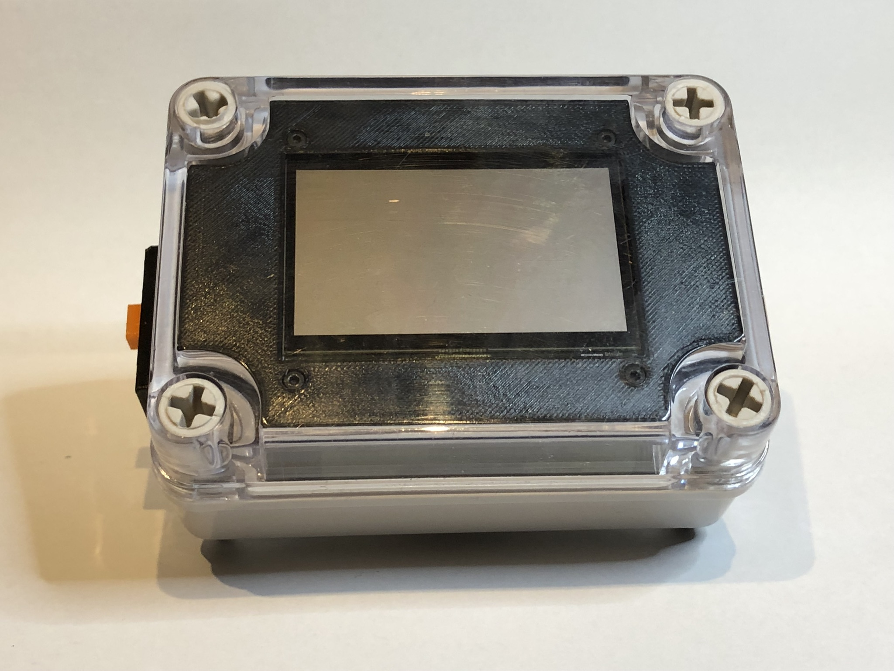
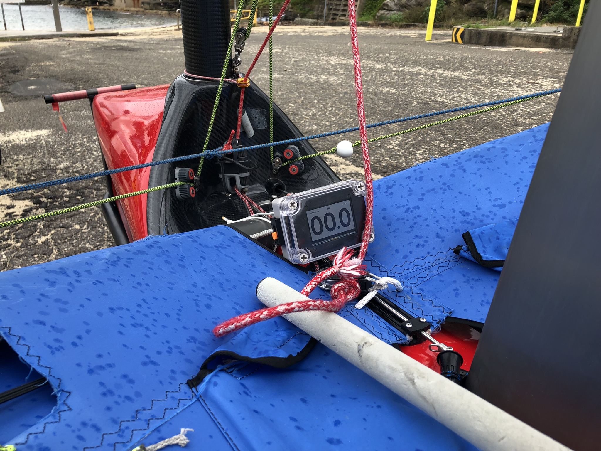

A prototype GPS tracker and interface, intended primarily as an on-water speed display.

The [firmware](firmware) is written in rust. A water resistant enclosure is used with various 3d printed components. In order to ensure water resistance, the external switches magnetically couple to internal reed switches.

# Schematic

# Components

## "Black Pill" STM32F411 board

https://core-electronics.com.au/stm32f411-blackpill-development-board-49034.html

## 3.3V LDO Regulator

https://core-electronics.com.au/pololu-3-3v-500ma-step-down-voltage-regulator-d24v5f3.html

## LS027B7DH01 LCD display 

https://core-electronics.com.au/adafruit-sharp-memory-display-breakout-2-7-400x240-monochrome.html

https://www.sharpsde.com/fileadmin/products/Displays/2016_SDE_App_Note_for_Memory_LCD_programming_V1.3.pdf

## GPS Receiver

[TBS M8.2 GPS Glonass][gps1]  (BN180 clone?)

## Waterproof Case

https://core-electronics.com.au/small-plastic-project-enclosure-weatherproof-with-clear-top.html

[gps1]: https://www.team-blacksheep.com/products/prod:tbs_m82_gps

